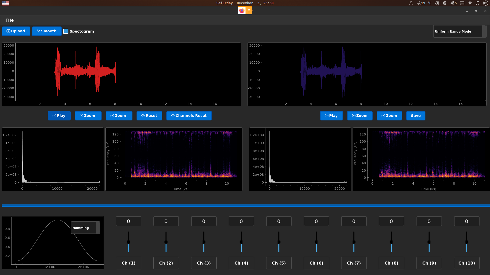
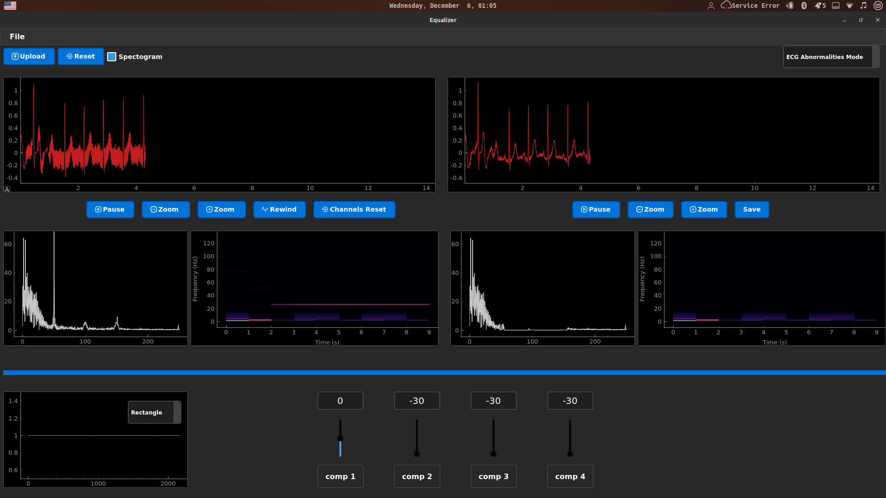
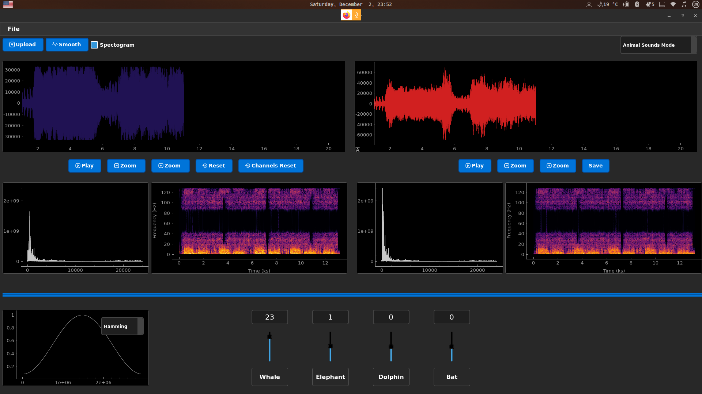

## Project Overview
This README provides detailed documentation for the Equalizer project, a practical implementation of audio signal processing techniques in Python. This project is designed to aid in understanding the principles of digital signal processing, specifically focusing on audio equalization, FFT, and spectrogram analysis.

## Key Features
- **Interactive GUI**: Built with PyQt5, offering a user-friendly interface for signal manipulation.
- **Audio Equalization**: Real-time audio signal adjustment using multiple frequency bands.
- **FFT Analysis**: Implementation of Fast Fourier Transform for understanding frequency components.
- **Spectrogram Visualization**: Frequency analysis over time represented visually.
- **Window Functions**: Utilization of various window functions for signal processing.

## Installation Requirements
Ensure Python is installed along with these libraries: PyQt5, pydub, pyqtgraph, numpy, scipy, sounddevice. Install them via pip:
```bash
pip install pyqt5 pydub pyqtgraph numpy scipy sounddevice
```

## Running the Application
Execute the script in the project directory:
```bash
python main_program.py
```

### Interface and Controls
- **Upload**: Load an audio file (.mp3, .wav).
- **Playback Controls**: Play, pause, and observe the effect of equalization.
- **Equalizer Sliders**: Manipulate different frequency bands.
- **Save Feature**: Export the altered audio.

### Advanced Functionalities
- **FFT & Spectrogram Displays**: Analyze the frequency spectrum and its variation over time.
- **Zoom Features**: Examine specific sections of the audio signal.
- **Mode Settings**: Switch between various preset modes for different audio types.

## Educational Use
- **Understanding Signal Processing**: Visual aids and real-time manipulation for grasping signal processing concepts.
- **Laboratory Application**: Ideal for lab sessions in signal processing or audio engineering courses.
- **Project Enhancement**: Opportunity to expand the project with additional features or improvements.

## Issues and Limitations
- Compatibility limited to .mp3 and .wav formats.
- Performance may vary based on system capabilities.

<p align="center">
  
</p>

<p align="center">
  
</p>

<p align="center">
  
</p>


## Contribution Guidelines
Contributions are encouraged, especially for educational purposes. Follow standard coding practices and submit pull requests for any enhancements.

---

## Team Members: <br>
1- Fady Mohsen <br>
2- Ahmad Mahmoud <br>
3- Shehab Mohamad <br>
4- Mohamad Aziz <br>